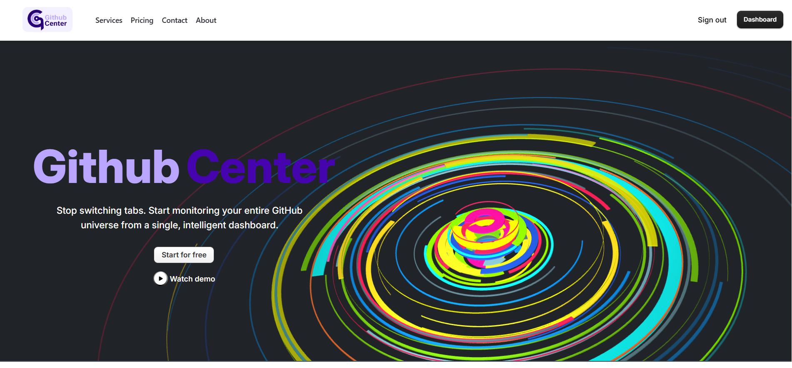
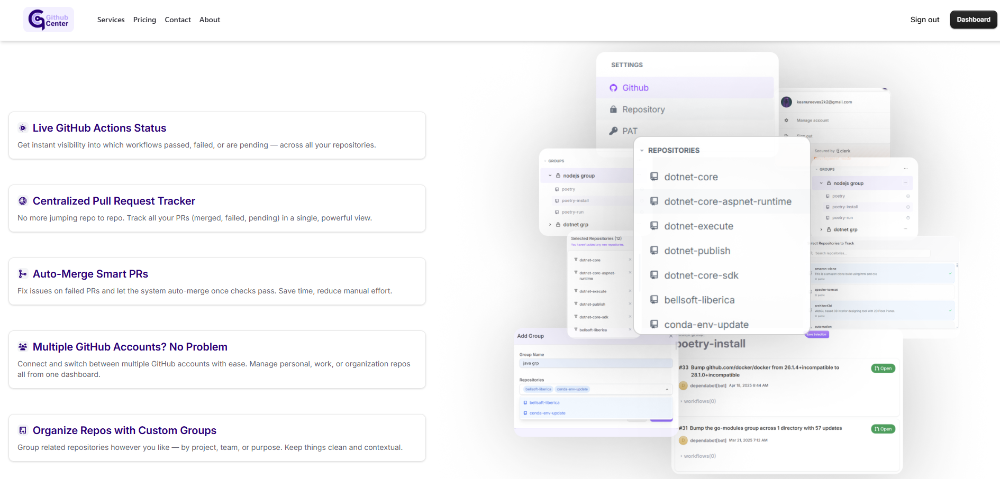
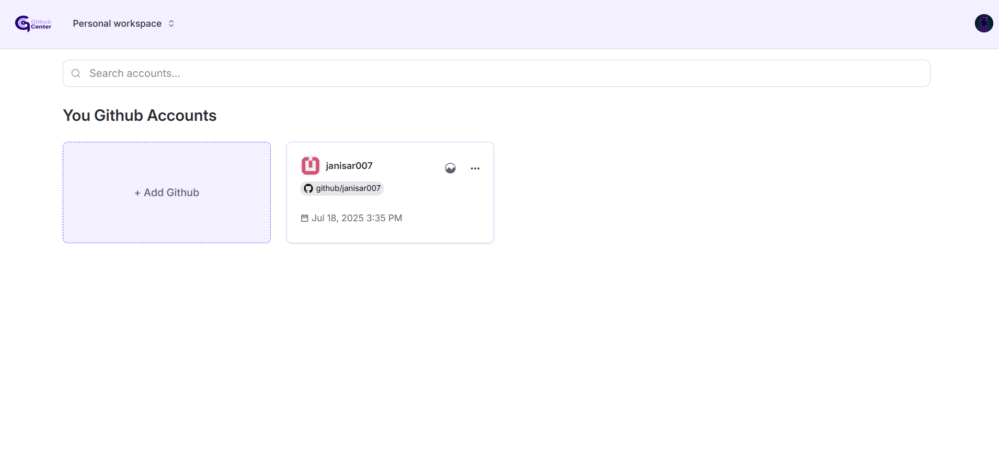

# GitHub Center

A centralized dashboard to manage all your GitHub repositories, workflows, and pull requests across multiple GitHub accounts — in one place.

---

## 🚀 Overview

Managing multiple repositories with several GitHub Actions workflows can be time-consuming and tedious.  
**GitHub Center** eliminates the need to check each repository manually by giving you a single interface to:

- View all repositories across one or more GitHub accounts.
- Monitor GitHub Actions workflow runs (passed/failed).
- Track pull request statuses (merged, failed, pending).
- Quickly navigate directly to the repository in GitHub.

---

## 🎯 Problem It Solves

> Imagine you have 20 repositories, each with 5+ workflows.  
> Some workflows fail, some pass, and pull requests may be pending or merged.  
> Normally, you'd open each repository daily to check them one by one.  
> **GitHub Center** automates this monitoring process, saving hours of manual work.

---

## ✨ Features

- **Multi-Account Support** — Connect and manage multiple GitHub accounts.
- **Centralized Repo Dashboard** — View all repositories in one place.
- **Workflow Monitoring** — Instantly see which workflows passed or failed.
- **Pull Request Tracker** — Identify failed or pending PRs that need action.
- **Repository Grouping** — Organize repos into custom groups for better management.
- **Direct GitHub Navigation** — One click to open the repo or PR in GitHub.
- **Secure Token Storage** —  
  - Personal Access Tokens (PATs) are encrypted and stored securely on our servers.
  - Tokens are **never** sent back to the browser after saving.
  - Backend token handling code is open source for transparency.

---

## 🛠 Tech Stack

**Frontend**  
- React.js  
- Tailwind CSS  
- Typescript 

**Backend**  
- Node.js  
- Express.js  
- MongoDB  

**Integrations**  
- GitHub REST API  

**Security**  
- Encrypted Personal Access Token storage  
- HTTPS
- [Clerk](https://clerk.com/docs/quickstarts/react) Authentication

---

## 📸 Screenshots / Demo





---

## ⚙️ Installation & Setup

1. **Clone the repository**  
   ```bash
   git clone https://github.com/janisar007/githubcenter-client.git
   cd githubcenter-client

2. **Install dependencies**  
   ```bash
   npm install

3. **Create .env.local file**  
   ```bash
   VITE_API_BASE_URL=<backend url (http://localhost:5000/api/)>
   VITE_CLERK_FRONTEND_API=<clerk-frontend-api (it stats with pk_test)>

4. **To Set up clerk authentication visit**  
   [Clerk Authentication](https://clerk.com/docs/quickstarts/react)

5. **To Set up backend go to**  
   [Backend](https://github.com/janisar007/github-center-api)


## 📜 License
All Rights Reserved © 2025 Janisar Akhtar

This repository and its contents are the property of Janisar Akhtar.

You are free to view, learn and use from the source code, but commercial use is strictly prohibited.
Unauthorized use will result in legal action under applicable copyright laws.